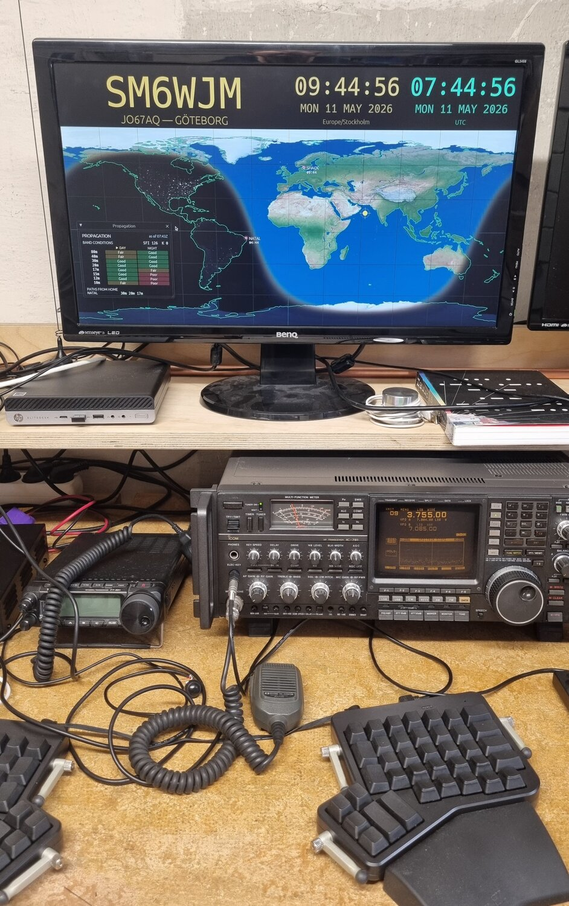
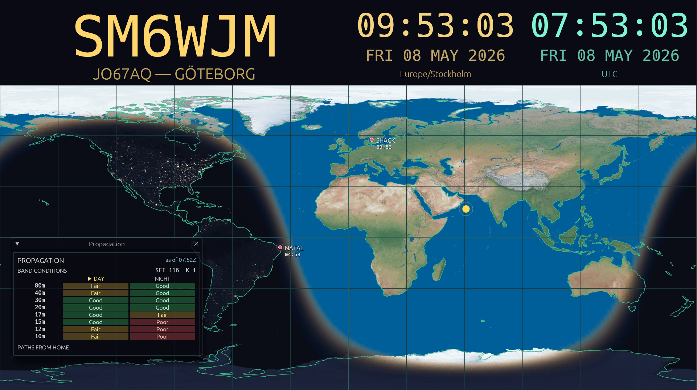

#+TITLE: wjmclock
#+SUBTITLE: Modern HamClock-style war-room display
#+OPTIONS: toc:nil num:nil ^:nil

#+CAPTION: wjmclock running fullscreen on a Raspberry Pi at the SM6WJM station.
#+ATTR_HTML: :width 600
#+ATTR_ORG: :width 600

#+CAPTION: Default layout at 1920×1080: callsign, dual clocks, equirectangular map with day/night terminator, and the propagation panel.

* TL;DR

wjmclock is a day/night terminator map (like a [[https://www.geochron.com/][geochron]]). Primary use
is for your ham radio station. It also displays your call as well as
local time and UTC. It's written in rust [[https://rust-lang.org/][rust]] and drawing is GPU
accelerated. no system install is necessary, it's a self contained
binary and a config file where you set your call and add markers to
other locations where you want to display local time.

You can check the script here: [[file:scripts/install.sh][scripts/install.sh]]

So far tested on, please let me know if you have tested it on other
platforms:

- Ubuntu 24.04 amd64
- Raspberry Pi 4 bookworm

#+begin_src bash
curl -fsSL https://raw.githubusercontent.com/ast/wjmclock/main/scripts/install.sh | bash
#+end_src

Downloads the right pre-built binary into =$HOME/wjmclock=, grabs the
example config, checks that the OpenGL / Wayland / X11 runtime
libraries are present, and launches. The script never uses ~sudo~ and
never installs anything — if a library is missing it prints the
~apt install~ command for you to run yourself.

* About

A modern, Rust + [[https://www.egui.rs/][egui]] reimplementation of [[https://www.hamclock.com/][HamClock]] for the ham radio shack:
clocks alongside a world map with a [[https://en.wikipedia.org/wiki/Grey_line_(radio_propagation)][grayline]] (day/night terminator), HF
band-condition readout, and per-marker propagation predictions. Built primarily
for a Raspberry Pi 4 driving a 1920×1080 wall display, but it scales cleanly to
other resolutions.

The grayline is rendered Geochron-style: a smooth gradient from transparent
daylight, through a warm twilight band, into a deep navy night. The map base
is Tom Patterson's *Natural Earth III* shaded relief on the day side with the
*Earth at Night* city-lights raster alpha-masked over the night side
(coastlines and a 30° grid are optional overlays). The subsolar point is shown
so you can tell at a glance where the sun is overhead right now.

The propagation overlay polls open data once an hour — solar indices (SFI,
K-index) from [[https://services.swpc.noaa.gov/][NOAA SWPC]] for a HamQSL-style HF
band-conditions table, and per-path MUF/LUF predictions from
[[https://prop.kc2g.com/][KC2G prop.kc2g.com]] for "open bands from the shack to each marker right now."
All network I/O happens on a worker thread; the UI thread never blocks.

The display is data-driven — every element on screen (clocks, callsign, map,
propagation) is a TOML entry that you can position, recolor, and add or
remove. Multiple clocks for different time zones are first-class, and any
number of map markers can be added with optional local-time labels.

* Pre-built binaries

Tagged releases ship Linux binaries for both ~x86_64~ and ~aarch64~ on the
[[https://github.com/ast/wjmclock/releases/latest][Releases page]]. Each release contains four files — full and stripped variants
per architecture:

| File suffix                           | Use                            |
|---------------------------------------+--------------------------------|
| =-x86_64-unknown-linux-gnu=           | Desktop / server, full symbols |
| =-x86_64-unknown-linux-gnu-stripped=  | Desktop / server, ~12% smaller   |
| =-aarch64-unknown-linux-gnu=          | Raspberry Pi 4/5, full symbols |
| =-aarch64-unknown-linux-gnu-stripped= | Raspberry Pi 4/5, smaller      |

The binaries are built on Ubuntu 22.04, so they require glibc ≥ 2.35 (Ubuntu
22.04+, Debian 12+, Pi OS bookworm+, RHEL 10+). Runtime deps are the same as
a local build — see [[#build][Build]] below.

For rolling builds from ~main~ (between releases), see the [[https://github.com/ast/wjmclock/actions/workflows/build.yml][build workflow]] —
each successful run keeps its artefacts for 30 days.

* Build
:PROPERTIES:
:CUSTOM_ID: build
:END:

Requires a recent stable Rust toolchain (edition 2024).

** Install with cargo

If you have a Rust toolchain set up, ~cargo install~ pulls and builds
straight from the repo (drops the binary in =~/.cargo/bin/wjmclock=):

#+begin_src bash
# Latest tagged release
cargo install --git https://github.com/ast/wjmclock --tag v0.1.3 --locked

# Or the tip of main
cargo install --git https://github.com/ast/wjmclock --locked
#+end_src

** Build from a checkout

#+begin_src bash
cargo build --release
#+end_src

Or with the bundled [[https://github.com/casey/just][just]] task runner:

#+begin_src bash
just release        # cargo build --release
just check          # fmt + clippy + tests
#+end_src

Linux runtime deps (Debian/Ubuntu): =libgl1=, =libegl1=, =libwayland-client0=,
=libxkbcommon0=, plus the X11 stack if you're not on Wayland. The [[file:Cross.toml][Cross.toml]]
lists exact =-dev= packages used during cross-compilation.

* Run

#+begin_src bash
cargo run                                 # uses the auto-loaded config (see below)
cargo run -- --config wjmclock.example.toml
cargo run -- --fullscreen --no-cursor     # kiosk mode
just run                                  # cargo run with the example config
#+end_src

** Hotkeys

| Key      | Action                                                          |
|----------+-----------------------------------------------------------------|
| =Esc=    | Quit                                                            |
| =Ctrl+Q= | Quit (Cmd+Q on macOS)                                           |
| =F=      | Toggle fullscreen                                               |
| (config) | Per-window toggles (e.g. =P= for the propagation window)        |

Window-slot elements can declare =key = "..."= in TOML to bind a hotkey that
toggles them on and off. The example config maps =P= to the propagation
window.

=--version= prints the crate version with the embedded git short hash, e.g.
=wjmclock 0.1.0 (e057858)= (with =-dirty= when the working tree has uncommitted
changes).

** Shell completion

=--completion <SHELL>= prints a completion script and exits. Supported
shells: =bash=, =zsh=, =fish=, =powershell=, =elvish=.

#+begin_src bash
# zsh / bash — source for the current shell session
source <(wjmclock --completion zsh)
source <(wjmclock --completion bash)

# fish
wjmclock --completion fish | source
#+end_src

For a permanent install, write the script into your shell's completion
directory, e.g. =~/.local/share/zsh/site-functions/_wjmclock= for zsh.

* Configuration

wjmclock looks for a TOML config in this order:

1. The file passed via =--config <PATH>=
2. =$XDG_CONFIG_HOME/wjmclock/wjmclock.toml= (e.g. =~/.config/wjmclock/wjmclock.toml=)
3. =./wjmclock.toml= in the current directory

If none exist, sensible defaults are used. CLI flags always override values
loaded from the config. A complete annotated example lives in
[[file:wjmclock.example.toml][wjmclock.example.toml]].

** CLI flags

| Flag                  | Description                                          |
|-----------------------+------------------------------------------------------|
| =-c, --config <PATH>= | Path to a TOML config file                           |
| =--width <PIXELS>=    | Window width in logical pixels                       |
| =--height <PIXELS>=   | Window height in logical pixels                      |
| =--fullscreen=        | Start fullscreen                                     |
| =--no-cursor=         | Hide the mouse cursor (kiosk mode)                   |
| =--version=           | Print version (with git hash) and exit               |

** =[window]=

| Key                 | Type   | Default     | Description                                  |
|---------------------+--------+-------------+----------------------------------------------|
| =width=             | int    | =1920=      | Window width in logical pixels               |
| =height=            | int    | =1080=      | Window height in logical pixels              |
| =fullscreen=        | bool   | =false=     | Start fullscreen                             |
| =no_cursor=         | bool   | =false=     | Hide the mouse cursor                        |
| =background=        | string | ="#0a0a14"= | Window background color (hex)                |
| =top_panel_height=  | float  | =0.22=      | Top-panel height as a fraction of the window |

** =[home]=

The station QTH. Optional, but required when a =type = "propagation"=
element is configured. Same shape as =[[marker]]= — the home is drawn on
the map alongside any other markers, and the propagation widget uses it as
the "from" end of path predictions.

** =[[marker]]=

Repeatable. Each marker is a labelled point drawn on the map. =location= is
either a Maidenhead locator string or an inline ={ lat, lon }= table — pick
whichever is more natural for the place. When =timezone= is set, the
marker's local time is drawn beneath its label.

| Key        | Type             | Default | Description                                                       |
|------------+------------------+---------+-------------------------------------------------------------------|
| =location= | string \vert table | (req.)  | ="JO67AQ"= (locator) *or* ={ lat = 57.7, lon = 12.0 }= (degrees) |
| =text=     | string           | (req.)  | Label drawn next to the marker                                    |
| =kind=     | string           | ="dot"= | Visual style (currently only =dot=)                               |
| =timezone= | string           | —       | IANA timezone (e.g. =Europe/Stockholm=) — adds a HH:MM line       |

** =[[element]]= — shared keys

Every element declares its =type= and a =slot= that places it in the layout.
Each slot has a small set of slot-specific keys (=align=, =rect=, =title=,
=key=, =open=); element-specific keys follow in the sections below.

| Key    | Type   | Description                                              |
|--------+--------+----------------------------------------------------------|
| =type= | string | =clock=, =map=, =callsign=, or =propagation=             |
| =slot= | string | =top=, =center=, or =window= (see below)                 |

*** =slot = "top"=

Pinned in the top panel (clocks, callsign). Multiple top-slot elements share
the panel: left-aligned ones pack from the left edge, right-aligned ones pack
from the right edge in declaration order.

| Key     | Type   | Default  | Description                                              |
|---------+--------+----------+----------------------------------------------------------|
| =align= | string | ="left"= | =left= or =right= — which side of the panel to pin to    |
| =width= | float  | —        | Optional fractional width (0..1 of the window)           |

*** =slot = "center"=

Fills the central panel (the map). Exactly one element may use =center=.

*** =slot = "window"=

A floating, draggable =egui::Window= that sits over the map (translucent by
default). Useful for the propagation overlay.

| Key     | Type   | Default       | Description                                                  |
|---------+--------+---------------+--------------------------------------------------------------|
| =rect=  | table  | (required)    | ={ x, y, w, h }= initial position+size as fractions (0..1)   |
| =title= | string | =type= name   | Title-bar text                                               |
| =open=  | bool   | =true=        | Whether the window is shown on startup                       |
| =key=   | string | —             | Key name (e.g. ="P"=, ="F1"=) that toggles open/closed       |

** =type = "clock"=

| Key        | Type   | Default     | Description                                       |
|------------+--------+-------------+---------------------------------------------------|
| =timezone= | string | ="UTC"=     | IANA timezone (e.g. =Europe/Stockholm=)           |
| =format=   | string | ="24h"=     | =24h= or =12h=                                    |
| =label=    | bool   | =true=      | Show the timezone label below the date            |
| =color=    | string | ="#7df5d2"= | Text color                                        |

** =type = "callsign"=

| Key        | Type   | Default     | Description                                       |
|------------+--------+-------------+---------------------------------------------------|
| =call=     | string | (required)  | The call sign to display                          |
| =subtitle= | string | —           | Optional subtitle (e.g. locator + city)           |
| =color=    | string | ="#ffd66b"= | Text color                                        |

** =type = "map"=

| Key               | Type   | Default             | Description                                                       |
|-------------------+--------+---------------------+-------------------------------------------------------------------|
| =projection=      | string | ="equirectangular"= | Projection (currently only equirectangular)                       |
| =texture=         | bool   | =false=             | Draw the bundled NE3 day basemap + Earth-at-Night overlay         |
| =coastline=       | bool   | =true=              | Draw the vector coastline overlay                                 |
| =terminator=      | bool   | =true=              | Draw the day/night grayline gradient                              |
| =day_color=       | string | ="#15233f"=         | Lit-ocean fill (used when =texture = false=)                      |
| =night_color=     | string | ="#04091e"=         | Deep-night overlay color (auto-fades when =texture = true=)       |
| =twilight_color=  | string | ="#ffb060"=         | Warm tint of the grayline band                                    |
| =twilight_extent= | float  | =12.0=              | Elevation° at full night: 6 civil / 12 nautical / 18 astronomical |
| =night_dim=       | float  | =0.85=              | Night-overlay opacity (0..1)                                      |
| =coast_color=     | string | ="#39c08c"=         | Coastline polyline color                                          |
| =grid=            | bool   | =true=              | Draw the 30° lat/lon grid                                         |
| =grid_color=      | string | ="#1c3a3a"=         | Grid color                                                        |
| =subsolar_marker= | bool   | =true=              | Draw the subsolar (overhead-sun) marker                           |
| =marker_color=    | string | ="#ff5577"=         | Color used for every =[[marker]]=                                 |

** =type = "propagation"=

HF propagation overlay. Fetches solar indices from
[[https://services.swpc.noaa.gov/][NOAA SWPC]] and per-path MUF/LUF predictions from
[[https://prop.kc2g.com/][KC2G prop.kc2g.com]] once an hour, in a background worker thread (UI never
blocks). Renders a global HF band-conditions table and per-marker
"open bands from home" predictions. Requires =[home]= to be set.

| Key                | Type | Default | Description                                              |
|--------------------+------+---------+----------------------------------------------------------|
| =band_conditions=  | bool | =true=  | Show HF band table (Day/Night Good/Fair/Poor per band)   |
| =path_predictions= | bool | =true=  | Show open bands from =[home]= to each =[[marker]]=       |

* Cross-compile and deploy

The repo ships a [[file:Cross.toml][=Cross.toml=]] for [[https://github.com/cross-rs/cross][cross-rs]] and a [[file:justfile][=justfile=]] with deploy
helpers. Default target is =aarch64-unknown-linux-gnu= (Raspberry Pi 4/5).

#+begin_src bash
just cross                  # release build for aarch64-unknown-linux-gnu
just deploy                 # cross + scp binary + config to ssh host `shack`
just deploy pi@elsewhere    # same flow, different host
#+end_src

=just deploy= places the binary at =~/wjmclock= on the remote and the config at
=~/.config/wjmclock/wjmclock.toml=. After that, ssh in and run:

#+begin_src bash
./wjmclock --fullscreen --no-cursor
#+end_src

* Acknowledgements

The bundled =natural_earth= basemap and =earth_at_night= overlay are from Tom
Patterson's *Natural Earth III* texture set, hosted in the public domain at
[[https://www.shadedrelief.com/natural3/pages/textures.html][shadedrelief.com/natural3]].

* License

Copyright (C) 2026 Albin Stigö.

wjmclock is free software: you can redistribute it and/or modify it under the
terms of the GNU General Public License as published by the Free Software
Foundation, either version 3 of the License, or (at your option) any later
version. See [[file:LICENSE][LICENSE]] for the full text.
